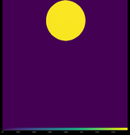
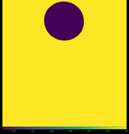

# Active Optics Linear Model

The model is using with two set of guide stars:
 * 1 on-axis guide star
 * 3 off-axis guide stars evenly spaced on a 6' ring 

M1 segment ID and the # of M2 modes is set in `config.rs`.

The linear interaction matrices between the source wavefronts and both M1 RBMS and M2 modes
are computed with
```
cargo run --release --bin calibration
```
and the linear model is run with
```
cargo run --release --bin linear_model
```

The unit norm field position vector of the off-axis guide stars are

| GS | #1 | #2 | #3 |
|:--:|:--:|:--:|:--:|
| x | 1 | -0.500 | -0.500 |
| y | 0 | +0.866 | -0.866|

The unit norm gradient vector of M1 aberrations are:

 * S1 

|   | Tx | Ty | Rx | Ry |
|:---:|:---:|:---:|:---:|:---:|
| Gx | +1 | 0 | 0 | +1 |
| Gy | 0 | +1 | -1 | 0 |

Residual aberrations in the field for each M1 S1 RBM corrected with M2 S1 ASM

| GS | #1 | #2 | #3 |
|:--:|:--:|:--:|:--:|
| Tx |  |  |  |
| Ty |  |  |  |
| Tz |  |  |  |
| Rx |  |  |  |
| Ry |  |  |  |
| Rz |  |  |  |

