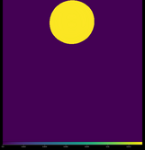

# Active Optics Linear Model

The model with two set of guide stars:
 * 1 on-axis guide star
 * 3 off-axis guide stars evenly spaced on a 6' ring 

The linear interaction matrices between the source wavefronts and both M1 RBMS and M2 modes
are derived with
```
cargo run --release --bin calibration --features m2,on-axis,modes
cargo run --release --bin calibration --features m2,off-axis,modes
cargo run --release --bin calibration --features m1,on-axis,rbms
cargo run --release --bin calibration --features m1,off-axis,rbms
```

The unit norm field position vector of the off-axis guide stars are

| GS | #1 | #2 | #3 |
|:--:|:--:|:--:|:--:|
| x | 1 | -0.500 | -0.500 |
| y | 0 | +0.866 | -0.866|

The unit norm gradient vector of M1 aberrations are:

 * S1 

|   | Rx | Ry |
|:---:|:---:|:---:|
| Gx | 0 | +1 |
| Gy | -1 | 0 |

| GS | #1 | #2 | #3 |
|:--:|:--:|:--:|:--:|
| Rx |  |  |  |
| Ry |  |  |  |

 * S2 

|   | Rx | Ry |
|:---:|:---:|:---:|
| Gx | -0.866 | +0.500 |
| Gy | -0.500 | -0.866 |